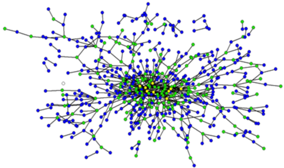
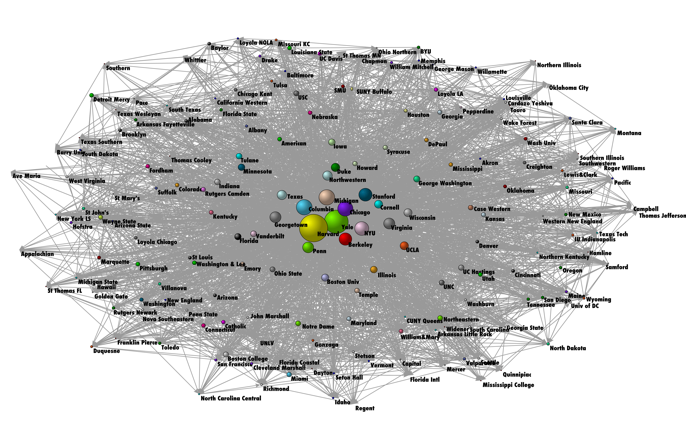

# System Analizy Orzeczeń Sądowych

System SAOS:

- gromadzone orzeczenia sądowe
- komputerowa analiza tekstu
- dostęp do danych przez API

Możliwości:

- Ilościowa analiza orzeczeń sądowych

**Krok w stronę wielkoskalowych analiz praktyki stosowania prawa**

# Podglądanie stosowania prawa

# Przykłady użycia SAOS

- Dostęp do danych przez API
- Zastosowanie R i technologii www.

 

Przykładowe moduły:

- Interfejs R do SAOS API
- Statystyki przeglądowe
- Składy orzekające i "współorzekanie"
- Sieć cytowań aktów prawnych
- Analiza decyzji ws. alimentów.
